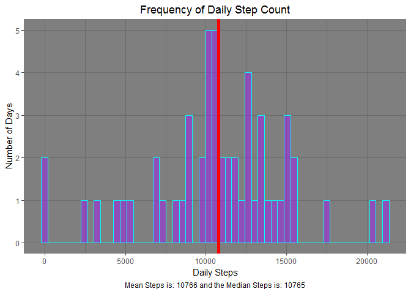
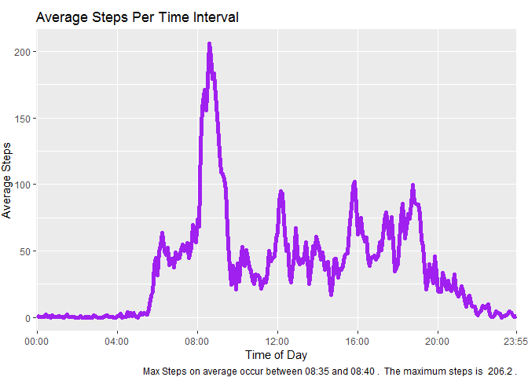
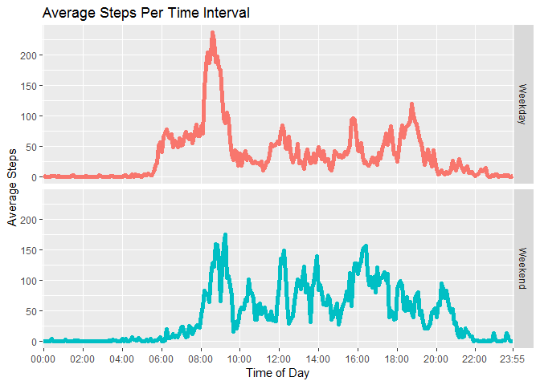

## Loading and preprocessing the data

```r
library(ggplot2)
library(lubridate)
library(stringr)
library(dplyr)

#Downloading raw data and reading it in
download.file(url = "https://d396qusza40orc.cloudfront.net/repdata%2Fdata%2Factivity.zip",
              dest = "ActivityMonitoringData.zip")
              
unzip(zipfile = "ActivityMonitoringData.zip")

activity <- read.csv(file=unzip(zipfile = "ActivityMonitoringData.zip",list = TRUE)[1,1],
                     header = TRUE)

#Removing missing data and renaming column headers
na_rows<-is.na(activity$steps)

total_steps_per_day <- activity[!na_rows,] %>% 
      group_by((activity[!na_rows,2])) %>% 
      summarize(sum(steps))
      
names(total_steps_per_day) <- c("day", "steps")


# Average across all days at each interval
avg_steps_per_interval <- activity[!na_rows,] %>% 
      group_by((activity[!na_rows,3])) %>% 
      summarize(mean(steps))
names(avg_steps_per_interval) <- c("interval", "steps")

#Adding a time format
avg_steps_per_interval$interval <- str_pad(avg_steps_per_interval$interval,width = 4,side = "left",pad="0") %>%
      strptime(format = "%H%M") %>%
      format(format = "%H:%M")

#Returns which time interval has the most steps on average
getMaxSteps<-function(x){
      order(x$steps,decreasing = TRUE)[1]
}

maxRow<-getMaxSteps(avg_steps_per_interval)


#Creates a new column that classifies the weekdays
activity$dayOfWeek<-weekdays(as_date(activity$date))
```


  
## What is mean total number of steps taken per day?


```r
ggplot(data = total_steps_per_day, aes(x=steps)) +
      geom_histogram(fill = "purple", color = "cyan", alpha = .5, bins = nrow(total_steps_per_day)) +
      labs(title = "Frequency of Daily Step Count", x= "Daily Steps", y = "Number of Days",
           caption = paste("Mean Steps is:", round(mean(total_steps_per_day$steps),0),
                           "and the Median Steps is:", median(total_steps_per_day$steps))) +
      theme_dark()+
      theme(panel.grid.minor.y = element_blank(), plot.title = element_text(hjust = .5), plot.caption = element_text(hjust = .5)) +
      geom_vline(data = total_steps_per_day, xintercept = mean(total_steps_per_day$steps), color = "black", lwd=2) + 
      geom_vline(data = total_steps_per_day, xintercept = median(total_steps_per_day$steps), color = "red", lwd=2)
```

<!-- -->

*Notice that the mean and median are nearly identical when missing values are removed.*  
  
## What is the average daily activity pattern?


```r
ggplot(data = avg_steps_per_interval, aes(x=interval, y= steps, group = 1)) +
      geom_line(color = "purple", lwd=2) +
      theme(plot.margin = margin(t=10,r=10))+
      scale_x_discrete(breaks = avg_steps_per_interval$interval[c(seq(from = 1, to = 288, by = 48),288)])+
      labs(x= "Time of Day", y = "Average Steps", title = "Average Steps Per Time Interval",
           caption = paste("Max Steps on average occur between", avg_steps_per_interval[maxRow,1],
                           "and", avg_steps_per_interval[maxRow+1,1],
                           ".  The maximum steps is ", round(avg_steps_per_interval[maxRow,2],digits=1), "."))
```

<!-- -->
  
## Imputing missing values


```r
#Missing values are imputed based on average steps in the corresponding day of the week and time interval.
impute_missing_steps<-function(x){
      missing<-is.na(x$steps)
      for (i in 1:length(missing)){
            if(missing[i]==TRUE){
                  matching_cohort<-filter(x,interval == x[i,]$interval,dayOfWeek == x[i,]$dayOfWeek)
                  x[i,]$steps<-(mean(matching_cohort[complete.cases(matching_cohort),]$steps))
            }
      }
      x
}

activity<-impute_missing_steps(activity)

# Average across all days at each interval, now with imputed values
total_steps_per_day <- activity %>% 
      group_by((activity[,2])) %>% 
      summarize(sum(steps))
names(total_steps_per_day) <- c("day", "steps")

ggplot(data = total_steps_per_day, aes(x=steps)) +
      geom_histogram(fill = "purple", color = "cyan", alpha = .5, bins = nrow(total_steps_per_day)) +
      labs(title = "Frequency of Daily Step Count", x= "Daily Steps", y = "Number of Days",
           caption = paste("Mean Steps is:", round(mean(total_steps_per_day$steps),0),
                           "and the Median Steps is:", median(total_steps_per_day$steps))) +
      theme_dark()+
      theme(panel.grid.minor.y = element_blank(), plot.title = element_text(hjust = .5), plot.caption = element_text(hjust = .5)) +
      geom_vline(data = total_steps_per_day, xintercept = mean(total_steps_per_day$steps), color = "black", lwd=2) + 
      geom_vline(data = total_steps_per_day, xintercept = median(total_steps_per_day$steps), color = "red", lwd=2)
```

<!-- -->

*Note that the mean and median have noticeable separation when missing values are imputed based on average steps in the corresponding day of the week and time interval.*  


## Are there differences in activity patterns between weekdays and weekends?

```r
avg_steps_per_interval <- activity

#Groups day of week into two categories: "Weekend" or "Weekday"
for (i in 1:nrow(avg_steps_per_interval)){
      avg_steps_per_interval$dayInd[i]<-if_else(avg_steps_per_interval[i,]$dayOfWeek == "Saturday" || avg_steps_per_interval[i,]$dayOfWeek == "Sunday","Weekend","Weekday")
}

# Average across weekdays or weekends at each interval, using imputed values
avg_steps_per_interval<- avg_steps_per_interval %>% 
      group_by(avg_steps_per_interval$interval, avg_steps_per_interval$dayInd) %>% 
      summarize(mean(steps)) %>% as.data.frame()
names(avg_steps_per_interval) <- c("interval", "dayInd", "steps")

#Adds time formatting
avg_steps_per_interval$interval <- str_pad(avg_steps_per_interval$interval,width = 4,side = "left",pad="0") %>%
      strptime(format = "%H%M") %>%
      format(format = "%H:%M")

ggplot(aes(interval,steps,color = dayInd,group = dayInd), data = avg_steps_per_interval)+
      geom_line(lwd = 2)+
      facet_grid(rows = vars(dayInd))+
      scale_x_discrete(breaks = avg_steps_per_interval$interval[c(seq(from = 1, to = 576, by = 48),576)])+
      labs(x= "Time of Day", y = "Average Steps", title = "Average Steps Per Time Interval")+
      theme(legend.position = "none")
```

<!-- -->

*Notice that the weekdays typically have more activity early in the morning, but have less activity throughout the day thereafter.*  
