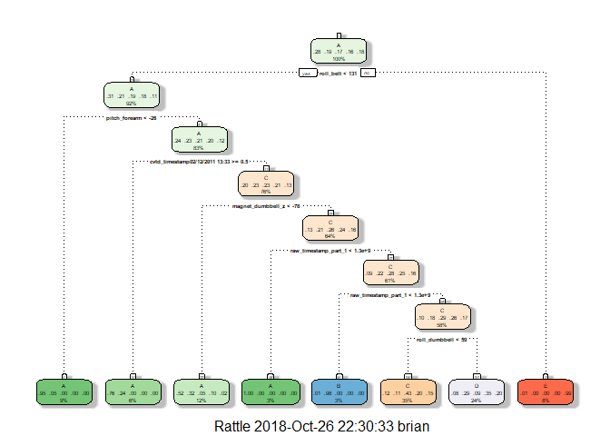

Overview
--------

The purpose of this project is to develop a model that can assign a qualitative score that assesses how well an activity was performed. The score is based on the letter grade scale A to E.
The data for this project come from this source: [Groupware@LES Weight Lifting Exercises](http://groupware.les.inf.puc-rio.br/har).

A few models will be created with R's caret package (using 75% of the data for model training and 25% for cross validation). The model with the greatest overall accuracy on the cross validation data set will be used to predict the quality of 20 records in a final test set.

``` r
library(caret)
```

    ## Loading required package: lattice

    ## Loading required package: ggplot2

``` r
library(dplyr)
```

    ## 
    ## Attaching package: 'dplyr'

    ## The following objects are masked from 'package:stats':
    ## 
    ##     filter, lag

    ## The following objects are masked from 'package:base':
    ## 
    ##     intersect, setdiff, setequal, union

``` r
library(rattle)
```

    ## Rattle: A free graphical interface for data science with R.
    ## Version 5.2.0 Copyright (c) 2006-2018 Togaware Pty Ltd.
    ## Type 'rattle()' to shake, rattle, and roll your data.

``` r
#Get data
download.file(url = "https://d396qusza40orc.cloudfront.net/predmachlearn/pml-training.csv", 
              destfile = "train_data.csv")
download.file(url = "https://d396qusza40orc.cloudfront.net/predmachlearn/pml-testing.csv", 
              destfile = "test_data.csv")

#Set seed for reproducibility
set.seed(42)

training<-read.csv("train_data.csv")
testing<-read.csv("test_data.csv")

#Custom function to be used for removing unneccessary columns
getNAProportion<-function(df){
      colSums(is.na(df)*1)/nrow(df)
}
```

Cleaning the Data
-----------------

The source data has many records with \#DIV/0! errors that cannot be used for quantitative analysis. Additionally, there are many variables that have either identical or missing values across all records. These records and variables will be removed, as they will not contribute anything meaningful to a predictive model.

``` r
#Remove error rows and variables with near zero variance

errorrows<-rowSums((training=="#DIV/0!")*1, na.rm = TRUE)
training<-training[errorrows==0,]
training<-training[,getNAProportion(training)!=1]
training<-training[,((nearZeroVar(training, saveMetrics= TRUE)$nzv*1)==0)]

testing<-testing[,getNAProportion(testing)!=1]
testing<-testing[,((nearZeroVar(testing, saveMetrics= TRUE)$nzv*1)==0)]
```

Single Tree Model
-----------------

To get a sense of how complex this data is, we will start by fitting a model from a single tree to the training data.

``` r
inTrain<-createDataPartition(training$classe,p=.75,list=FALSE)
newTrain<-training[inTrain,-1]
newTest<-training[-inTrain,-1]

treeFit <- train(classe ~ ., data=newTrain, method="rpart")
fancyRpartPlot(treeFit$finalModel)
```



``` r
predtree<-predict(treeFit,newdata = newTest)
confusionMatrix(predtree,newTest$classe)
```

    ## Confusion Matrix and Statistics
    ## 
    ##           Reference
    ## Prediction    A    B    C    D    E
    ##          A 1073  286   29   66   15
    ##          B    4  145    1    0    0
    ##          C  193  190  706  325  228
    ##          D   92  308  102  395  219
    ##          E    5    0    0    0  420
    ## 
    ## Overall Statistics
    ##                                           
    ##                Accuracy : 0.5704          
    ##                  95% CI : (0.5562, 0.5844)
    ##     No Information Rate : 0.2847          
    ##     P-Value [Acc > NIR] : < 2.2e-16       
    ##                                           
    ##                   Kappa : 0.4582          
    ##  Mcnemar's Test P-Value : NA              
    ## 
    ## Statistics by Class:
    ## 
    ##                      Class: A Class: B Class: C Class: D Class: E
    ## Sensitivity            0.7849  0.15608   0.8425  0.50254  0.47619
    ## Specificity            0.8847  0.99871   0.7639  0.82047  0.99872
    ## Pos Pred Value         0.7304  0.96667   0.4300  0.35394  0.98824
    ## Neg Pred Value         0.9118  0.83147   0.9582  0.89392  0.89445
    ## Prevalence             0.2847  0.19346   0.1745  0.16368  0.18367
    ## Detection Rate         0.2234  0.03020   0.1470  0.08226  0.08746
    ## Detection Prevalence   0.3059  0.03124   0.3419  0.23240  0.08850
    ## Balanced Accuracy      0.8348  0.57740   0.8032  0.66151  0.73746

Random Forest Model
-------------------

We can see that there is a lot of room for improvement from this single tree, based on how well it predicts on the cross validation set.
Let's see how a random forest compares to this single tree.

``` r
#From https://github.com/lgreski/datasciencectacontent/blob/master/markdown/pml-randomForestPerformance.md
fitControl <- trainControl(method = "cv", number = 10, allowParallel = TRUE)

parallelforestFit <- train(classe ~ ., data=newTrain, method="rf", trControl=fitControl)
predpforest<-predict(parallelforestFit,newdata = newTest)
confusionMatrix(predpforest,newTest$classe)
```

    ## Confusion Matrix and Statistics
    ## 
    ##           Reference
    ## Prediction    A    B    C    D    E
    ##          A 1367    0    0    0    0
    ##          B    0  929    1    0    0
    ##          C    0    0  837    0    0
    ##          D    0    0    0  786    0
    ##          E    0    0    0    0  882
    ## 
    ## Overall Statistics
    ##                                      
    ##                Accuracy : 0.9998     
    ##                  95% CI : (0.9988, 1)
    ##     No Information Rate : 0.2847     
    ##     P-Value [Acc > NIR] : < 2.2e-16  
    ##                                      
    ##                   Kappa : 0.9997     
    ##  Mcnemar's Test P-Value : NA         
    ## 
    ## Statistics by Class:
    ## 
    ##                      Class: A Class: B Class: C Class: D Class: E
    ## Sensitivity            1.0000   1.0000   0.9988   1.0000   1.0000
    ## Specificity            1.0000   0.9997   1.0000   1.0000   1.0000
    ## Pos Pred Value         1.0000   0.9989   1.0000   1.0000   1.0000
    ## Neg Pred Value         1.0000   1.0000   0.9997   1.0000   1.0000
    ## Prevalence             0.2847   0.1935   0.1745   0.1637   0.1837
    ## Detection Rate         0.2847   0.1935   0.1743   0.1637   0.1837
    ## Detection Prevalence   0.2847   0.1937   0.1743   0.1637   0.1837
    ## Balanced Accuracy      1.0000   0.9999   0.9994   1.0000   1.0000

The fit is really good! The model took a while to run, so let's see if we can achieve a similar level of out-of-sample error with a generalized boost model.

Generalized Boost Model
-----------------------

``` r
boostFit <- train(classe ~ ., data=newTrain, method="gbm", verbose = FALSE)
predboost<-predict(boostFit,newdata = newTest)
confusionMatrix(predboost,newTest$classe)
```

    ## Confusion Matrix and Statistics
    ## 
    ##           Reference
    ## Prediction    A    B    C    D    E
    ##          A 1367    0    0    0    0
    ##          B    0  929    1    0    0
    ##          C    0    0  828    0    0
    ##          D    0    0    9  786    3
    ##          E    0    0    0    0  879
    ## 
    ## Overall Statistics
    ##                                           
    ##                Accuracy : 0.9973          
    ##                  95% CI : (0.9954, 0.9986)
    ##     No Information Rate : 0.2847          
    ##     P-Value [Acc > NIR] : < 2.2e-16       
    ##                                           
    ##                   Kappa : 0.9966          
    ##  Mcnemar's Test P-Value : NA              
    ## 
    ## Statistics by Class:
    ## 
    ##                      Class: A Class: B Class: C Class: D Class: E
    ## Sensitivity            1.0000   1.0000   0.9881   1.0000   0.9966
    ## Specificity            1.0000   0.9997   1.0000   0.9970   1.0000
    ## Pos Pred Value         1.0000   0.9989   1.0000   0.9850   1.0000
    ## Neg Pred Value         1.0000   1.0000   0.9975   1.0000   0.9992
    ## Prevalence             0.2847   0.1935   0.1745   0.1637   0.1837
    ## Detection Rate         0.2847   0.1935   0.1724   0.1637   0.1830
    ## Detection Prevalence   0.2847   0.1937   0.1724   0.1662   0.1830
    ## Balanced Accuracy      1.0000   0.9999   0.9940   0.9985   0.9983

The generalized boost model also took a long while to run, and the accuracy is not quite as high as the random forest model. Thus, the random forest model will be our chosen model to submit. Let's predict the classe factors of the test data set.

Final Results
-------------

``` r
#Final Results
predforest2<-predict(parallelforestFit,newdata = testing)
table(seq(from=1,to=nrow(testing), by=1),predforest2)
```

    ##     predforest2
    ##      A B C D E
    ##   1  0 1 0 0 0
    ##   2  1 0 0 0 0
    ##   3  0 1 0 0 0
    ##   4  1 0 0 0 0
    ##   5  1 0 0 0 0
    ##   6  0 0 0 0 1
    ##   7  0 0 0 1 0
    ##   8  0 1 0 0 0
    ##   9  1 0 0 0 0
    ##   10 1 0 0 0 0
    ##   11 0 1 0 0 0
    ##   12 0 0 1 0 0
    ##   13 0 1 0 0 0
    ##   14 1 0 0 0 0
    ##   15 0 0 0 0 1
    ##   16 0 0 0 0 1
    ##   17 1 0 0 0 0
    ##   18 0 1 0 0 0
    ##   19 0 1 0 0 0
    ##   20 0 1 0 0 0

The Weight Lifting Exercises dataset is credited to: \*\*Velloso, E.; Bulling, A.; Gellersen, H.; Ugulino, W.; Fuks, H. Qualitative Activity Recognition of Weight Lifting Exercises. Proceedings of 4th International Conference in Cooperation with SIGCHI (Augmented Human '13) . Stuttgart, Germany: ACM SIGCHI, 2013.

Read more: <http://groupware.les.inf.puc-rio.br/har#ixzz5V6P4ggCs**>
